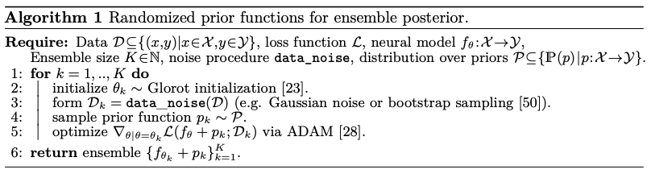

# Randomized Prior Net

Inspired by [Randomized Prior Functions for Deep Reinforcement Learning](https://arxiv.org/pdf/1806.03335.pdf) and [Training Independent Subnetworks for Robust Predictions](https://arxiv.org/pdf/2010.06610.pdf), this repository contains a tensorflow implementation of a model capable of providing a measure of uncertainty in its predictions.



It is both conceptually and technically simple: an ensemble of distinct subnetworks is trained in the same forward-backward pass. Each one outputs its own prediction while the error is backpropagated from the sum of their respective losses. It allows performing a form of deep ensembling while only adding a very small computational overhead. In addition, each subnetwork contains a layer of frozen weights acting as fixed priors that the encoders learn to compensate.

The two sources of randomness (frozen prior nets and learnable encoders) provide some sort of bagging, making the result more robust and allowing to measure uncertainty as the spread of the subnetworks' predictions around the mean. It could be further improved by providing bootstrapped batches during the training.

The example provided is adapted to regression problems, but the logic can easily be adapted to binary/multi-class classification tasks.

## Dependencies

- python 3.9+
- tensorflow 2.12+
- numpy 1.23+
- scipy 1.11+

## Usage

```python
import tensorflow as tf
from model.randomized_prior_nn import RandomizedPrioNet

# load your tf dataset
ds_train = ...
ds_val = ...

model = RandomizedPrioNet(
    num_hidden_prior=1,
    dim_hidden_prior=16,
    num_hidden_encoder=2,
    dim_hidden_encoder=64,
    dropout_encoder=0.2,
    num_subnetworks=10,
    prior_scale=1.0,
)

optimizer = tf.keras.optimizers.Adam(learning_rate=1e-2)
loss = tf.keras.losses.MeanSquaredError(reduction=tf.keras.losses.Reduction.SUM_OVER_BATCH_SIZE)
model.compile(optimizer=optimizer, loss=loss)

history = model.fit(
    ds_train,
    validation_data=ds_val,
    epochs=10,
)

y_pred, y_pred_intervals = model.predict(X_test)
```

See the notebook in `example/example.ipynb` for the end-to-end process.
